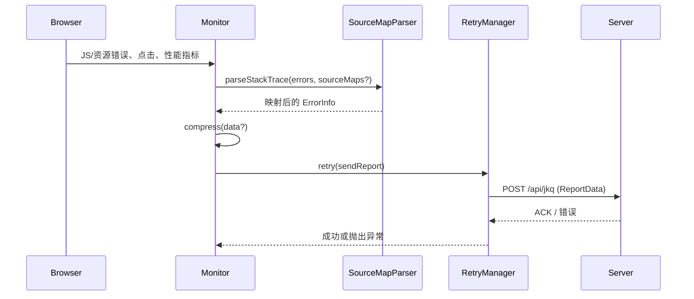

# @monitor/sdk 架构解剖

`packages/sdk` 是浏览器端监控 SDK，`core/index.ts` 中的 `Monitor` 将采集、压缩、重试、SourceMap 与插件机制串联起来，并通过 `@monitor/shared` 的类型/工具维持与服务器的契约。

## 1. 组件关系图

```mermaid
flowchart TD
  subgraph Browser 事件
    ErrEvt[window error &\nunhandledrejection]
    ActEvt[document click]
    PerfEvt[PerformanceObserver entries]
  end

  subgraph 采集层
    EH[setupErrorHandlers\ncore/index.ts]
    AT[setupActionTracking\ncore/index.ts]
    PM[PerformanceMonitor\ncore/performance.ts]
  end

  ErrEvt --> EH --> ErrQueue[errorQueue]
  ActEvt --> AT --> ActQueue[actionQueue]
  PerfEvt --> PM --> Metrics[PerformanceMetrics]

  subgraph Monitor 核心
    Monitor[Monitor\ncore/index.ts]
    Plugins[PluginManager\nplugins/index.ts]
  end

  ErrQueue --> Monitor
  ActQueue --> Monitor
  Metrics --> Monitor
  Plugins -.安装/扩展.-> Monitor

  subgraph 加工层
    Parser[EnhancedSourceMapParser\ncore/sourcemap.ts]
    SourceMaps[已上传 SourceMaps 缓存]
    Compressor[@monitor/shared/utils::compress]
  end

  Monitor --> Parser
  SourceMaps --> Parser
  Parser --> Monitor
  Monitor --> Compressor

  subgraph 传输层
    Uploader[SourceMapUploader\ncore/source-uploader.ts]
    Retry[RetryManager\ncore/retry.ts]
    Sender[sendReport -> fetch]
    Server[(监控服务器 /api)]
  end

  Monitor --> Uploader
  Uploader -->|POST /api/sourcemaps| Server
  Monitor --> Retry --> Sender -->|POST /api/jkq| Server
  Compressor --> Retry
```

## 2. 数据流序列图



## 3. 模块职责速览

| 模块                    | 职责摘要                                                                           | 关键代码                  |
| ----------------------- | ---------------------------------------------------------------------------------- | ------------------------- |
| Monitor                 | 初始化错误/性能/行为采集，维护队列并执行 `report()`                                | `core/index.ts`           |
| PerformanceMonitor      | 通过 `PerformanceObserver` 收集 FCP/LCP/FID/CLS 并在 `checkAndReport()` 中触发上报 | `core/performance.ts`     |
| RetryManager            | 基于指数退避封装 `retry()`，最多 3 次重试                                          | `core/retry.ts`           |
| EnhancedSourceMapParser | 解析堆栈，优先匹配上传 SourceMap，回退到 URL 拉取                                  | `core/sourcemap.ts`       |
| SourceMapUploader       | 支持 `File`/路径读取，POST `${reportUrl}/api/sourcemaps`                           | `core/source-uploader.ts` |
| PluginManager           | 注册/安装插件，供宿主扩展采集链路                                                  | `plugins/index.ts`        |

## 4. 运行链路

1. **采集层**：`setupErrorHandlers()` 捕获 `error`/`unhandledrejection`，`setupActionTracking()` 监听 `click`，`PerformanceMonitor` 在 `observeFCP/LCP/FID/CLS` 中收集指标。
2. **加工层**：`report()` 组装 `ReportData`（`@monitor/shared/types`），可选执行 `compress()`（`@monitor/shared/utils`），并在 `enableCompression` 打开时改变载荷格式。
3. **SourceMap & 插件**：`uploadSourceMap(s)` 上传 Base64 内容并缓存到 `sourceMaps`；`EnhancedSourceMapParser` 通过 `mapPositionWithUploadedMap()` 提升堆栈可读性；`PluginManager.install()` 允许第三方在 `Monitor` 生命周期钩住行为。
4. **传输层**：`sendReport()` 使用 `fetch` POST `${reportUrl}/api/jkq`，若 `enableRetry` 为真则交由 `RetryManager.retry()` 处理失败重试，成功后清空 `errorQueue/actionQueue/performanceMetrics`。

## 5. 演进建议

1. **批量节流**：结合 `maxErrors`、`sampleRate` 与浏览器 `visibilitychange` 事件，构建更智能的触发策略，避免频繁上报。
2. **插件生命周期**：扩展 `Plugin` 接口（如 `beforeReport/afterReport`）以便插件能参与数据加工或重写目标 URL。
3. **SourceMap 状态 API**：暴露 `getUploadedSourceMaps()` 供宿主 UI 查询当前版本的 SourceMap 上传情况，提升运维可视性。
