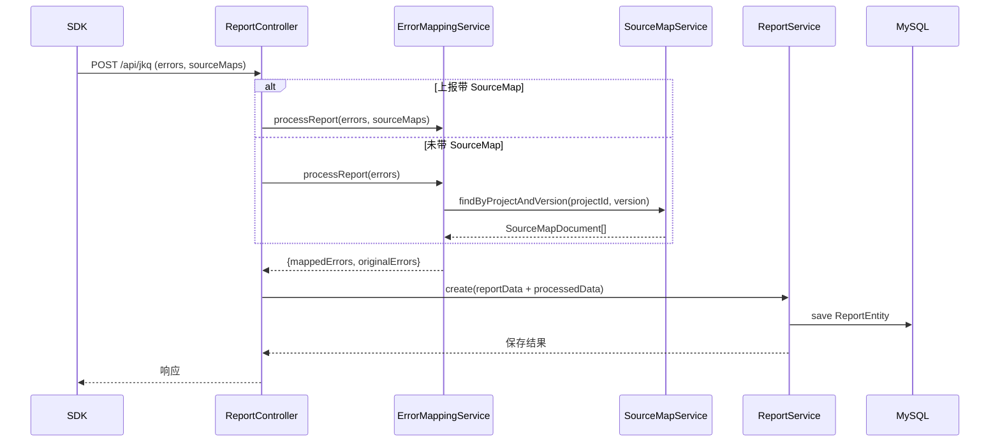

# @monitor/server 架构解剖

`packages/server` 基于 NestJS，`src/app.module.ts` 聚合配置、MySQL、SourceMap、报表、错误映射、AI 分析等模块，`src/main.ts` 统一配置全局过滤器、压缩与 CORS。

## 1. 模块关系图

```mermaid
flowchart LR
  Client[SDK /api 调用]
  Client -->|ReportData| ReportCtrl[ReportController\nreport/report.controller.ts]
  Client -->|SourceMap 上传| SMCtrl[SourceMapController\nsourcemap/sourcemap.controller.ts]
  Client -->|版本管理| SMVerCtrl[SourceMapVersionController\nsourcemap/sourcemap-version.controller.ts]

  ReportCtrl --> ReportSvc[ReportService\nreport/report.service.ts]
  ReportCtrl --> ErrMapSvc[ErrorMappingService\nerror-mapping/error-mapping.service.ts]
  ErrMapSvc --> SMsvc[SourceMapService\nsourcemap/sourcemap.service.ts]
  ErrMapSvc --> ReportSvc
  SMCtrl --> SMsvc
  SMVerCtrl --> SMVerSvc[SourceMapVersionService\nsourcemap/sourcemap-version.service.ts]

  ReportSvc --> MySQL[(MySQL\nReportEntity)]
  SMsvc --> MySQL
  SMVerSvc --> MySQL
  SMsvc --> Cache[(CacheModule\nTTL 300s)]

  subgraph Async/AI
    QueueSvc[QueueService\nqueue/queue.service.ts]
    AiSvc[AiService\nai/ai.service.ts]
  end

  ReportSvc -.push.-> QueueSvc
  QueueSvc -.pop.-> AiSvc
  AiSvc -.update?.-> ReportSvc
  SMsvc --> Health[getHealth()]
```

## 2. 错误上报序列图



## 3. 模块职责速览

| 模块                   | 职责摘要                                                                                                                      | 关键实现         |
| ---------------------- | ----------------------------------------------------------------------------------------------------------------------------- | ---------------- |
| `src/main.ts`          | 启动 Nest 应用，注册 `HttpExceptionFilter`、`CompressionInterceptor`、`compression` 中间件并启用 CORS                         | `main.ts`        |
| ReportModule           | `ReportController` 接收 `/api/jkq`、`/api/reports/:projectId`，`ReportService` 写入 `ReportSchema` 并预留 AI/队列钩子         | `report/`        |
| SourceMapModule        | `SourceMapController` 管理 SourceMap 上传/查询/健康检查，`SourceMapService` 封装 CRUD、分页、Base64 解码、`source-map` 消费者 | `sourcemap/`     |
| SourceMapVersionModule | `SourceMapVersionController/Service` 维护版本级操作（创建、回滚、对比、建议、清理）并使用聚合统计 `fileCount/totalSize`       | `sourcemap/`     |
| ErrorMappingModule     | `ErrorMappingService` 在 `processReport()` 中匹配 SourceMap、生成 `MappedErrorInfo` 并调用 `ReportService.saveMappedErrors()` | `error-mapping/` |
| ErrorReportModule      | 注册 `ErrorReportEntity`，用于保存精细化错误记录（导出 `TypeOrmModule`）                                                      | `error-report/`  |
| AiModule & QueueModule | `AiService` 通过 `modelAnalysis()` 调外部模型，`QueueService` 以 Redis list 实现 `push/pop/length`，支撑异步分析              | `ai/`, `queue/`  |

## 4. 存储与基础设施

- **MySQL**：通过 `TypeOrmModule.forRoot()` 读取 `MYSQL_*` 环境变量；`report/entities/report.entity.ts`、`sourcemap/entities/sourcemap.entity.ts`、`error-report/entities/error-report.entity.ts` 定义核心表结构并建立索引，SourceMap 表维护 `expiresAt` 便于定时清理。
- **缓存**：`SourceMapModule` 注册 `CacheModule`（`ttl=300`），`SourceMapVersionService` 注入 `CACHE_MANAGER` 准备缓存版本列表（部分 `cache.del` 暂注释以简化调试）。
- **Redis 队列**：`QueueService` 在 `onModuleInit()` 中建立单一连接，提供 JSON 化的 `push`/`pop`，用于 AI 分析或后续异步任务。
- **外部模型服务**：`AiService` 通过 `modelAnalysis()` 调用 `https://docs.newapi.pro/v1/chat/completions` 并依赖 `Authorization` 头中的密钥，建议迁移到 `.env`。

## 5. 演进建议

1. **依赖注入规范化**：`ReportController.createJkq()` 当前通过动态 `import` + `new ErrorMappingService()` 绕过 Nest IoC，应改为在模块层声明 `ErrorMappingService` 并注入，保证缓存/连接复用。
2. **高级搜索落地**：`SourceMapController.advancedSearch()` 仍调用 `findByProjectAndVersion('', '', ...)`，应替换为 `SourceMapService.advancedSearch()` 并传入 DTO 的筛选条件。
3. **安全合规**：`ai/alModel.ts` 中硬编码的 API Key 应移至环境变量，结合 `ConfigService` 统一加载，并为请求增加超时/重试策略。
4. **异步分析闭环**：重新启用 `QueueModule` & `AiModule` 在 `AppModule` 的依赖，并在 `ReportService.create()` 中恢复推送/消费逻辑，实现错误上报→AI 分析→结果回写的完整流程。
